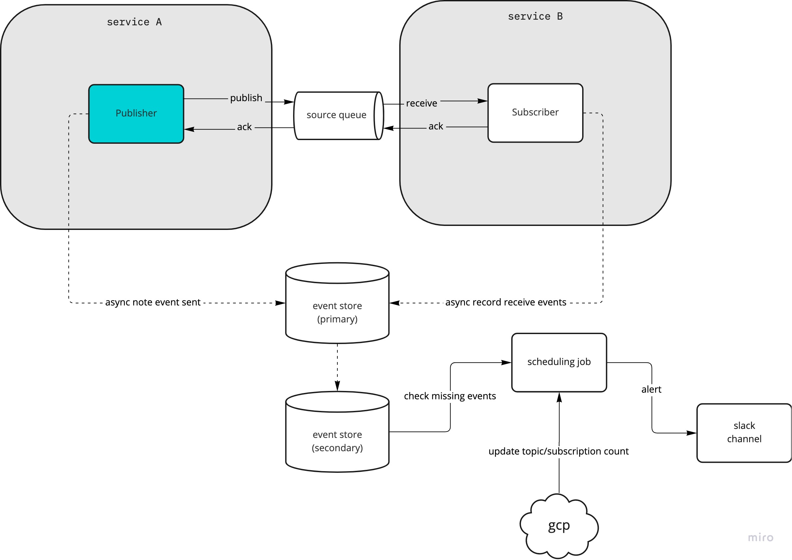

# event-sourcing-poc

## Design Concept



## Development

To develop Event Horizon you need to have Docker and Docker Compose installed.

To run all unit tests:
```shell
make test
```

To run and stop services for integration tests:
```shell
make run
make stop
```
